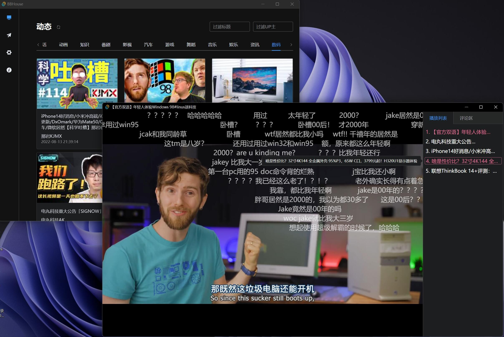
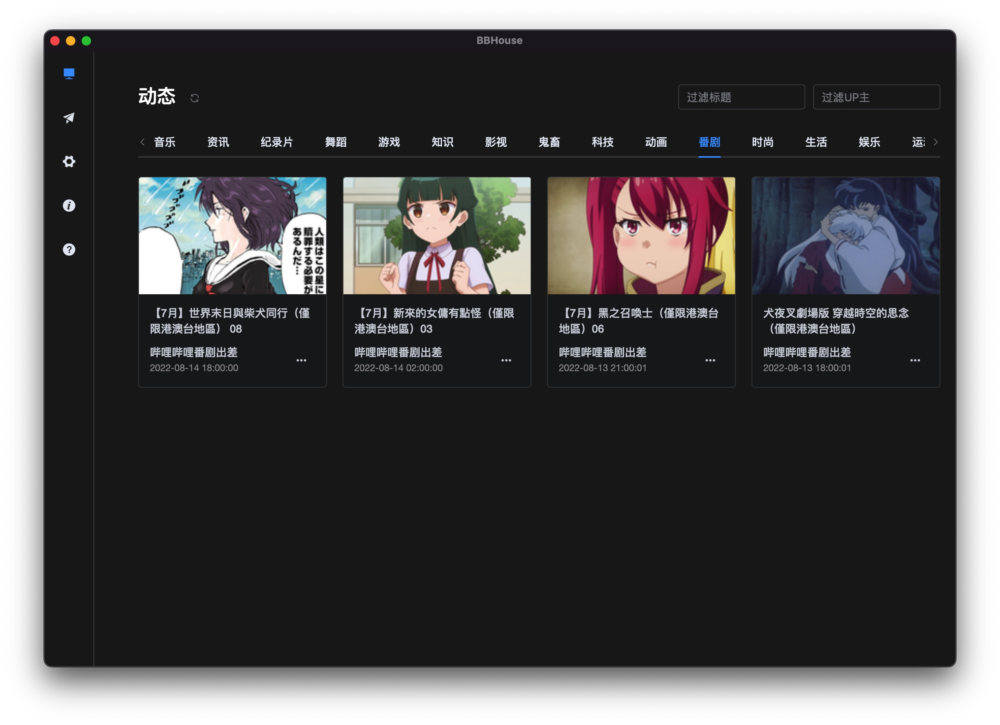

# BBHouse

    

_取自常见的『我在B站买了房』的评论_

---
`BBHouse` 是一款 [哔哩哔哩](https://www.bilibili.com) 的第三方应用，基于 [Tauri](https://github.com/tauri-apps/tauri) 跨平台构建，支持 `Windows` `macOS` `Linux`.

## 核心功能
- 一个支持对视频(直播)动态分区展示的主页, 去除了B博和推荐流
- 一个支持无限添加的 (临时的) 稍后播放列表与配套的播放器
> 请注意, 本项目`无法`也`无能力`为非大会员提供大会员的服务.

## feature
- 极简, 目前`只有`视频动态和播放功能 **_没有推荐流_** **_没有B博_**
- 支持视频动态过滤 by `分区` | `标题` | `UP主`
- 独立窗口的播放器 支持播放列表
- 替换了随机出现的PCDN
- 对 [BBDown](https://github.com/nilaoda/BBDown) 的进行了简单封装
> 此功能需要先自行安装**BBDown**, 并安装**ffmpeg**和**aria2c**.
- 性能优秀, 实测 Win 11 下启动速度与原生UWP相当, Mac 下也是
- 跨平台, 已经Release了 `macOS` | `Ubuntu` | `Win` 的安装包
- 明/暗主题支持

## 解决的痛点
1. 关注太多UP主(2000+), 无法快速有效的阅览完动态和视频
2. B站网页太占资源, 开20-30个视频Tab会导致新Edge直接崩溃
3. 近期随机出现的 PCDN 影响大会员体验
4. 通过 CMD 使用 BBDown 稍显麻烦

## 存在的问题
### 功能
- DPlayer, 或者说原生`<Video>`组件不支持混流, 借助事件机制配合 [APlayer](https://github.com/DIYgod/APlayer) (基于原生`<Audio>`组件)简单实现混流, 可能会发生音画不同步的情况 (多出现在切换视频时), 暂停再播放可缓解
- 评论区和弹幕屏蔽缺少高级功能, 只能满足简单浏览
### 项目
- 项目中把 Utils 全部写成了 Hooks 的命名形式, 属于个人放飞自我的做法, 觉得这样更美观
- 由于目前涉及的功能很少, 项目中没有对请求和页面做模块化封装

## todo
- Rust + WASM 探索播放混流的解决可能
- 完善评论区, 增加特色功能--如『枝网查重』等
- 完善播放器与弹幕的高级功能, 改进DPlayer的弹幕引擎
- 深度链接, 支持从网页跳转
- 多窗口播放模式
- 自定义插件支持
- 其他的功能模块

## 技术细节
- 基于Vue 3 + Vite + TypeScript 构建用户界面
- 核心播放功能与弹幕引擎来自 [DPlayer.js](https://github.com/DIYgod/DPlayer)
- API来自公开仓库 [bilibili-API-collect](https://github.com/SocialSisterYi/bilibili-API-collect)
- Rust 建立本地反向代理进行取流
- Tauri 沟通用户界面与Rust模块并构建完整二进制文件

## 跨平台
### Windows
- win 11 21H2 所有功能正常, 可开启HEVC
- win 10 1809 所有功能正常, 可开启HEVC
> 请注意, 21H1 之前的Win10并没有内置WebView2, 安装时会自动下载, 安装时间会比较长

> 开启HEVC需要安装 [来自设备制造商的HEVC扩展](https://apps.microsoft.com/store/detail/%E6%9D%A5%E8%87%AA%E8%AE%BE%E5%A4%87%E5%88%B6%E9%80%A0%E5%95%86%E7%9A%84-hevc-%E8%A7%86%E9%A2%91%E6%89%A9%E5%B1%95/9N4WGH0Z6VHQ?hl=zh-cn&gl=CN)

### macOS
- macOS 12.6 界面功能正常, 但由于WebKit下`<Video>`组件的未知问题, 使用Dash播放时缓冲策略异常, 需要非常久才能播放
- 已强制切换为FLV模式, 此模式对网络质量要求较高
- 用户可通过 "强制DASH播放" 进行Dash播放可行性测试

### Ubuntu
- Ubuntu 20.04 界面部分组件异常, 播放异常, 且Dash与FLV均无法播放, 推测原因是WebKitGtk版本过低, 需要4.0以上
> 作者的 Ubuntu 20.04 上`tauri`相关工具链安装失败, 无法调试, 计划近期升级至22.04测试
- 用户可通过 "强制DASH播放" 进行测试

### 运行截图:

## 致谢 
- [Tauri](https://github.com/tauri-apps/tauri) Build smaller, faster, and more secure desktop applications with a web frontend.
- [Vue](https://vuejs.org/) The progressive framework for building user interfaces.
- [Vite](https://github.com/vitejs/vite) Next generation frontend tooling. It's fast!
- [Element-Plus](https://github.com/element-plus/element-plus) 🎉 A Vue.js 3 UI Library made by Element team
- [DPlayer.js](https://github.com/DIYgod/DPlayer) 🍭 Wow, such a lovely HTML5 danmaku video player
- [APlayer.js](https://github.com/DIYgod/APlayer) 🍭 Wow, such a beautiful HTML5 music player
- [bilibili-API-collect](https://github.com/SocialSisterYi/bilibili-API-collect) 哔哩哔哩-API收集整理【不断更新中....】
- [BBDown](https://github.com/nilaoda/BBDown) Bilibili Downloader. 一款命令行式哔哩哔哩下载器.
- [flv.js](https://github.com/bilibili/flv.js) HTML5 FLV Player
- [hls.js](https://github.com/video-dev/hls.js/) HLS.js is a JavaScript library that plays HLS in browsers with support for MSE.
- [crypto-js](https://github.com/brix/crypto-js) JavaScript library of crypto standards.
- [qrcode.vue](https://github.com/scopewu/qrcode.vue) A Vue.js component to generate qrcode.
- [vue3-contextmenu](https://github.com/Hunlongyu/vue3-contextmenu) vue3 contextmenu. vue3 右键菜单
- [tokio](https://github.com/tokio-rs/tokio) A runtime for writing reliable asynchronous applications with Rust. Provides I/O, networking, scheduling, timers, ...
- [hyper](https://github.com/hyperium/hyper) An HTTP library for Rust
- [hyper-rustls](https://github.com/rustls/hyper-rustls) Integration between hyper HTTP library and rustls TLS stack
- [anyhow](https://github.com/dtolnay/anyhow) Flexible concrete Error type built on std::error::Error
